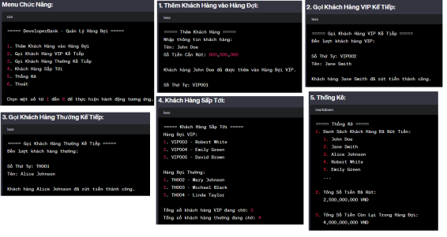

# Quản lý hàng đợi khách hàng - Developer Bank

Bạn nhận được dự án phát triển một chương trình quản lý hàng đợi của khách hàng rút tiền tại ngân hàng. với các yêu cầu như sau:

Có 2 hằng chờ:
- dành cho khách hàng thường
- dành cho khách hàng VIP

Tạo menu chức năng cho người dùng để thực hiện các thao tác sau:

```console
1. Thêm khách hàng vào hàng đợi.
2. Gọi tên khách hàng kế tiếp (VIP)
3. Gọi tên khách hàng kế tiếp (Thường).
4. Danh Sách Khách hàng sắp tới.
5. Thống kê
6. Thoát khỏi chương trình.
```

1. Khi thêm khách hàng vào hàng đợi
  - Nhập thông tin sau: Tên khách hàng và Số tiền cần rút. 
  - Nếu số tiền cần rút lớn hơn 500.000.000, khách hàng sẽ được coi là VIP và được thêm vào cuối hàng đợi của khách VIP. Ngược lại khách hàng sẽ được thêm vào cuối hàng đợi của khách bình thường.
  - Mỗi khách hàng khi thêm vào hàng đợi sẽ được gán một số thứ tự.

2. Khi gọi tên khách hàng kế tiếp(VIP và Thường)
  - Hiển thị tên và số thứ tự của khách hàng đến lượt rút tiền.
  - Sau khi hiển thị thì coi như là khách hàng này đã hoàn thành việc rút tiền và không nằm trong hàng đợi rút tiền nữa.

4. Danh Sách Khách hàng sắp tới:
  - Hiển thị thông tin về 3 khách hàng gần nhất hàng đợi VIP và tổng số lượng khách hàng đang chờ
  - Hiển thị thông tin về 3 khách hàng gần nhất hàng đợi Thường và tổng số lượng khách hàng đang chờ

5. Trong phần thống kê hiển thị 3 thông tin nhau:
  - Hiển thị danh sách các khách hàng đã rút tiền.
  - Tính tổng số tiền đã rút từ danh sách khách hàng.
  - Hiển thị tổng số tiền còn lại trong hàng đợi(cả VIP và Thường).

- Chương trình sẽ dùng LinkedList & Queue để thao tác dữ liệu.
- Menu chương trình như sau:


- Nâng cao: Dữ liệu của chương trình lưu trong file JSON và sẽ không bị mất nếu chương trình đột ngột dừng lại.
- Tạo dữ liệu giả bằng cách https://www.mockaroo.com/
- Viết unit test cho các hàm đã triển khai để đảm bảo hoạt động được như mong đợi

